# Data Structures Lab Assignment 2

This repository contains the solutions and outputs for the Lab Assignment 2.

--
## Question 1:

### Code
```c
#include <stdio.h>

int main() {
    int arr[100], n, i, key, low, high, mid, found = 0;

    printf("Enter number of elements: ");
    scanf("%d", &n);

    printf("Enter elements in sorted order:\n");
    for (i = 0; i < n; i++)
        scanf("%d", &arr[i]);

    printf("Enter element to search: ");
    scanf("%d", &key);

    low = 0;
    high = n - 1;
    while (low <= high) {
        mid = (low + high) / 2;
        if (arr[mid] == key) {
            printf("Found at position %d\n", mid);
            found = 1;
            break;
        } else if (arr[mid] < key) {
            low = mid + 1;
        } else {
            high = mid - 1;
        }
    }

    if (!found)
        printf("Not found\n");

    return 0;
}
```
### Output
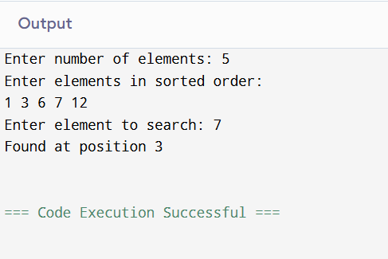

## Question 2:

### Code
```c
#include <stdio.h>

int main() {
    int arr[] = {64, 34, 25, 12, 22, 11, 90};
    int n = 7, i, j, temp;

    for (i = 0; i < n - 1; i++) {
        for (j = 0; j < n - i - 1; j++) {
            if (arr[j] > arr[j + 1]) {
                temp = arr[j];
                arr[j] = arr[j + 1];
                arr[j + 1] = temp;
            }
        }
    }

    printf("Sorted array:\n");
    for (i = 0; i < n; i++) {
        printf("%d ", arr[i]);
    }
    return 0;
}
```

### Output
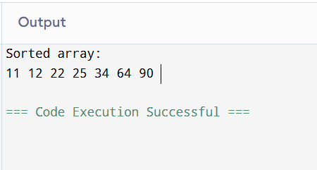

## Question 3(a):

### Code
```c
#include <stdio.h>

int main() {
    int arr[100], n, i, sum = 0, total;
    printf("Enter n (array size should be n-1): ");
    scanf("%d", &n);

    printf("Enter %d elements (range 1 to n):\n", n - 1);
    for (i = 0; i < n - 1; i++) {
        scanf("%d", &arr[i]);
        sum += arr[i];
    }

    total = n * (n + 1) / 2;
    printf("Missing number is: %d\n", total - sum);
    return 0;
}
```
### Output
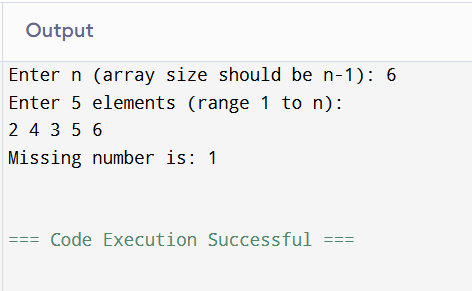

## Question 3(b):

### Code
```c
#include <stdio.h>

int main() {
    int arr[100], n, i, low, high, mid, missing;

    printf("Enter n (array size should be n-1): ");
    scanf("%d", &n);

    printf("Enter %d elements in sorted order (range 1 to n):\n", n - 1);
    for (i = 0; i < n - 1; i++)
        scanf("%d", &arr[i]);

    low = 0;
    high = n - 2;
    while (low <= high) {
        mid = (low + high) / 2;
        if (arr[mid] == mid + 1)
            low = mid + 1;
        else
            high = mid - 1;
    }

    missing = low + 1;
    printf("Missing number is: %d\n", missing);
    return 0;
}
```
### Output
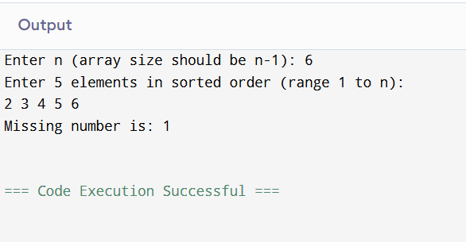

## Question 4(a):

### Code
```c
#include <stdio.h>
#include <string.h>

int main() {
    char s1[100], s2[100];
    int i, j;

    printf("Enter first string: ");
    fgets(s1, sizeof(s1), stdin);
    printf("Enter second string: ");
    fgets(s2, sizeof(s2), stdin);

    // Remove newline added by fgets if present
    if (s1[strlen(s1) - 1] == '\n') s1[strlen(s1) - 1] = '\0';
    if (s2[strlen(s2) - 1] == '\n') s2[strlen(s2) - 1] = '\0';

    
    for (i = 0; s1[i] != '\0'; i++);

    for (j = 0; s2[j] != '\0'; j++) {
        s1[i] = s2[j];
        i++;
    }
    s1[i] = '\0';

    printf("Concatenated String: %s\n", s1);

    return 0;
}
```

### Output
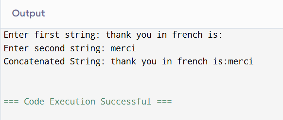

## Question 4(b):

### Code
```c
#include <stdio.h>
#include <string.h>

int main() {
    char str[100];
    int i, j;
    char temp;

    printf("Enter a string: ");
    fgets(str, sizeof(str), stdin);

    if (str[strlen(str) - 1] == '\n') str[strlen(str) - 1] = '\0';

    j = strlen(str) - 1;

    for (i = 0; i < j; i++, j--) {
        temp = str[i];
        str[i] = str[j];
        str[j] = temp;
    }

    printf("Reversed String: %s\n", str);

    return 0;
}
```
### Output
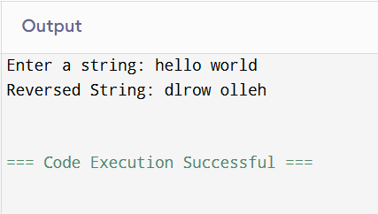

## Question 4(c):

### Code
```c
#include <stdio.h>
#include <string.h>

int main() {
    char str[100], result[100];
    int i, j = 0;

    printf("Enter a string: ");
    fgets(str, sizeof(str), stdin);

    if (str[strlen(str) - 1] == '\n') str[strlen(str) - 1] = '\0';

    for (i = 0; str[i] != '\0'; i++) {
        if (!(str[i] == 'a' || str[i] == 'e' || str[i] == 'i' || str[i] == 'o' || str[i] == 'u' ||
              str[i] == 'A' || str[i] == 'E' || str[i] == 'I' || str[i] == 'O' || str[i] == 'U')) {
            result[j] = str[i];
            j++;
        }
    }
    result[j] = '\0';

    printf("String without vowels: %s\n", result);

    return 0;
}
```
### Output
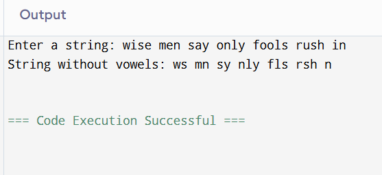

## Question 4(d):

### Code
```c
#include <stdio.h>
#include <string.h>

int main() {
    char str[100];
    int i, j;
    char temp;

    printf("Enter a string: ");
    fgets(str, sizeof(str), stdin);

    // remove newline character if fgets captures it
    int len = strlen(str);
    if (str[len - 1] == '\n') {
        str[len - 1] = '\0';
        len--;
    }

    // Bubble sort to arrange characters
    for (i = 0; i < len - 1; i++) {
        for (j = i + 1; j < len; j++) {
            if (str[i] > str[j]) {
                temp = str[i];
                str[i] = str[j];
                str[j] = temp;
            }
        }
    }

    printf("String in alphabetical order: %s\n", str);

    return 0;
}
```

### Output
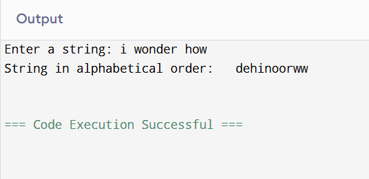

## Question 4(e):

### Code
```c
#include <stdio.h>
#include <string.h>

int main() {
    char str[100];
    int i;

    printf("Enter a string: ");
    fgets(str, sizeof(str), stdin);

    if (str[strlen(str) - 1] == '\n') str[strlen(str) - 1] = '\0';

    for (i = 0; str[i] != '\0'; i++) {
        if (str[i] >= 'A' && str[i] <= 'Z') {
            str[i] = str[i] + 32;
        }
    }

    printf("Lowercase String: %s\n", str);

    return 0;
}
```

### Output


## Question 5(a):

### Code
```c
#include <stdio.h>
int main() {
    int n, i;
    printf("Enter order of diagonal matrix: ");
    scanf("%d", &n);
    int diag[n];
    printf("Enter diagonal elements:\n");
    for(i = 0; i < n; i++) {
        scanf("%d", &diag[i]);
    }

    printf("Reconstructed Matrix:\n");
    for(i = 0; i < n; i++) {
        for(int j = 0; j < n; j++) {
            if(i == j)
                printf("%d ", diag[i]);
            else
                printf("0 ");
        }
        printf("\n");
    }
    return 0;
}
```
### Output
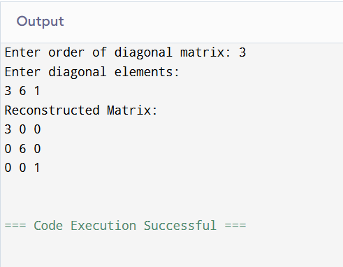

## Question 5(b):

### Code
```c
#include <stdio.h>

int main() {
    int n;
    printf("Enter the size of square matrix: ");
    scanf("%d", &n);

    int size = 3 * n - 2;  // required space
    int tri[size];

    printf("Enter elements of tri-diagonal matrix:\n");
    int k = 0;

    for (int i = 0; i < n; i++) {
        for (int j = 0; j < n; j++) {
            int x;
            scanf("%d", &x);

            if (i == j || i == j - 1 || i == j + 1) {
                tri[k++] = x;   // store only non-zero positions
            }
        }
    }

    printf("\nStored tri-diagonal elements:\n");
    for (int i = 0; i < size; i++) {
        printf("%d ", tri[i]);
    }
    printf("\n");

    return 0;
}
```

### Output
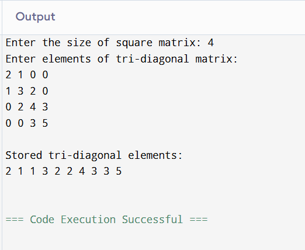

## Question 5(c):

### Code
```c
#include <stdio.h>

int main() {
    int n;
    printf("Enter order of lower triangular matrix: ");
    scanf("%d", &n);

    int size = n * (n + 1) / 2;
    int lower[size];

    printf("Enter elements row by row:\n");
    int k = 0;
    for (int i = 0; i < n; i++) {
        for (int j = 0; j < n; j++) {
            int x;
            scanf("%d", &x);
            if (i >= j) lower[k++] = x;
        }
    }

    printf("Stored elements: ");
    for (int i = 0; i < size; i++) printf("%d ", lower[i]);
    return 0;
}
```

### Output
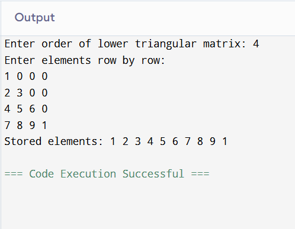

## Question 5(d):

### Code
```c
#include <stdio.h>

int main() {
    int n;
    printf("Enter order of upper triangular matrix: ");
    scanf("%d", &n);

    int size = n * (n + 1) / 2;
    int upper[size];

    printf("Enter elements row by row:\n");
    int k = 0;
    for (int i = 0; i < n; i++) {
        for (int j = 0; j < n; j++) {
            int x;
            scanf("%d", &x);
            if (i <= j) upper[k++] = x;
        }
    }

    printf("Stored elements: ");
    for (int i = 0; i < size; i++) printf("%d ", upper[i]);
    return 0;
}
```

### Output
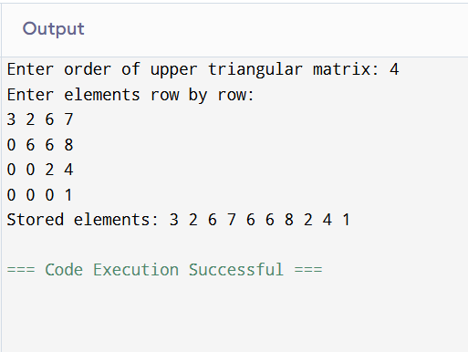

## Question 5(e):

### Code
```c
#include <stdio.h>

int main() {
    int n;
    printf("Enter order of symmetric matrix: ");
    scanf("%d", &n);

    int size = n * (n + 1) / 2;
    int sym[size];

    printf("Enter elements row by row:\n");
    int k = 0;
    for (int i = 0; i < n; i++) {
        for (int j = 0; j < n; j++) {
            int x;
            scanf("%d", &x);
            if (i >= j) sym[k++] = x; // store only lower half
        }
    }

    printf("Stored elements: ");
    for (int i = 0; i < size; i++) printf("%d ", sym[i]);
    return 0;
}
```

### Output
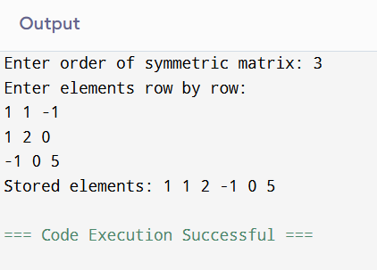

## Question 6(a):

### Code
```c
#include <stdio.h>

int main() {
    int m, n, t, i, j, k;
    int triplet[100][3], transpose[100][3];

    printf("Enter rows, columns and number of non-zero elements: ");
    scanf("%d %d %d", &m, &n, &t);

    printf("Enter triplet representation (row col value):\n");
    for (i = 0; i < t; i++) {
        scanf("%d %d %d", &triplet[i][0], &triplet[i][1], &triplet[i][2]);
    }

    // Transpose
    k = 0;
    for (i = 0; i < n; i++) {
        for (j = 0; j < t; j++) {
            if (triplet[j][1] == i) {
                transpose[k][0] = triplet[j][1];
                transpose[k][1] = triplet[j][0];
                transpose[k][2] = triplet[j][2];
                k++;
            }
        }
    }

    printf("Transpose triplet (row col value):\n");
    for (i = 0; i < k; i++) {
        printf("%d %d %d\n", transpose[i][0], transpose[i][1], transpose[i][2]);
    }

    return 0;
}
```
### Output
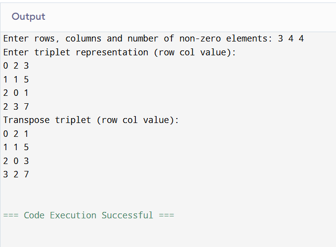

## Question 6(b):

### Code
```c
#include <stdio.h>

int main() {
    int m, n, t1, t2, i, j, k;
    int A[100][3], B[100][3], C[100][3];

    printf("Enter rows and columns of matrices: ");
    scanf("%d %d", &m, &n);

    printf("Enter number of non-zero elements in Matrix A: ");
    scanf("%d", &t1);
    printf("Enter triplet for Matrix A (row col value):\n");
    for (i = 0; i < t1; i++) scanf("%d %d %d", &A[i][0], &A[i][1], &A[i][2]);

    printf("Enter number of non-zero elements in Matrix B: ");
    scanf("%d", &t2);
    printf("Enter triplet for Matrix B (row col value):\n");
    for (i = 0; i < t2; i++) scanf("%d %d %d", &B[i][0], &B[i][1], &B[i][2]);

    i = j = k = 0;
    while (i < t1 && j < t2) {
        if (A[i][0] < B[j][0] || (A[i][0] == B[j][0] && A[i][1] < B[j][1])) {
            C[k][0] = A[i][0]; C[k][1] = A[i][1]; C[k][2] = A[i][2];
            i++; k++;
        }
        else if (B[j][0] < A[i][0] || (B[j][0] == A[i][0] && B[j][1] < A[i][1])) {
            C[k][0] = B[j][0]; C[k][1] = B[j][1]; C[k][2] = B[j][2];
            j++; k++;
        }
        else {
            C[k][0] = A[i][0]; C[k][1] = A[i][1]; 
            C[k][2] = A[i][2] + B[j][2];
            i++; j++; k++;
        }
    }

    while (i < t1) { C[k][0] = A[i][0]; C[k][1] = A[i][1]; C[k][2] = A[i][2]; i++; k++; }
    while (j < t2) { C[k][0] = B[j][0]; C[k][1] = B[j][1]; C[k][2] = B[j][2]; j++; k++; }

    printf("Resultant Matrix (triplet form):\n");
    for (i = 0; i < k; i++) {
        printf("%d %d %d\n", C[i][0], C[i][1], C[i][2]);
    }

    return 0;
}
```
### Output
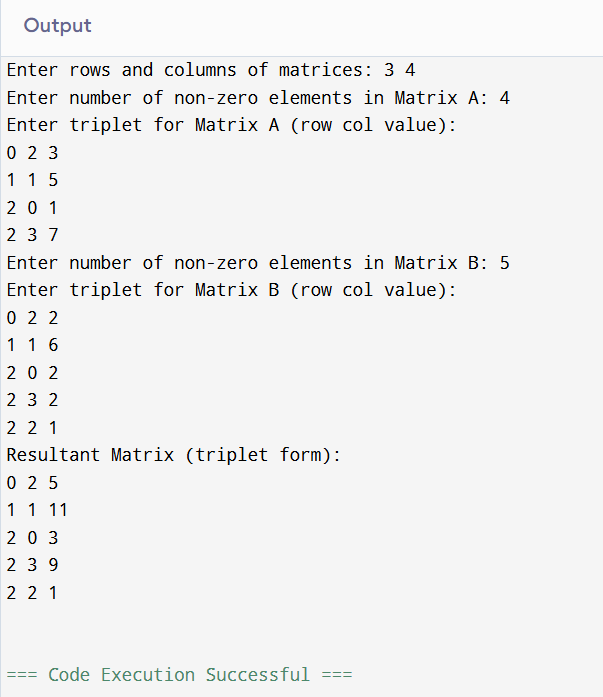

## Question 6(c):

### Code
```c
#include <stdio.h>

int main() {
    int m, n, p, t1, t2, i, j, k, x;
    int A[100][3], B[100][3], C[100][3];
    int temp[100][100] = {0};

    printf("Enter rows and columns of Matrix A: ");
    scanf("%d %d", &m, &n);

    printf("Enter number of non-zero elements in Matrix A: ");
    scanf("%d", &t1);
    printf("Enter triplet for Matrix A (row col value):\n");
    for (i = 0; i < t1; i++) scanf("%d %d %d", &A[i][0], &A[i][1], &A[i][2]);

    printf("Enter rows and columns of Matrix B: ");
    scanf("%d %d", &n, &p);

    printf("Enter number of non-zero elements in Matrix B: ");
    scanf("%d", &t2);
    printf("Enter triplet for Matrix B (row col value):\n");
    for (i = 0; i < t2; i++) scanf("%d %d %d", &B[i][0], &B[i][1], &B[i][2]);

    // Multiplication logic (convert to normal using temp first)
    for (i = 0; i < t1; i++) {
        for (j = 0; j < t2; j++) {
            if (A[i][1] == B[j][0]) {
                temp[A[i][0]][B[j][1]] += A[i][2] * B[j][2];
            }
        }
    }

    // Convert back to triplet
    k = 0;
    for (i = 0; i < m; i++) {
        for (j = 0; j < p; j++) {
            if (temp[i][j] != 0) {
                C[k][0] = i;
                C[k][1] = j;
                C[k][2] = temp[i][j];
                k++;
            }
        }
    }

    printf("Resultant Matrix (triplet form):\n");
    for (x = 0; x < k; x++) {
        printf("%d %d %d\n", C[x][0], C[x][1], C[x][2]);
    }

    return 0;
}
```

### Output
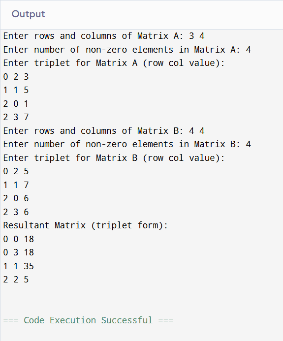

## Question 7:

### Code
```c
#include <stdio.h>

int main() {
    int arr[100], n, i, j, count = 0;

    printf("Enter number of elements: ");
    scanf("%d", &n);

    printf("Enter %d elements:\n", n);
    for (i = 0; i < n; i++) 
        scanf("%d", &arr[i]);

    printf("Inversion pairs are:\n");
    for (i = 0; i < n - 1; i++) {
        for (j = i + 1; j < n; j++) {
            if (arr[i] > arr[j]) {
                printf("(%d, %d)\n", arr[i], arr[j]);
                count++;
            }
        }
    }

    printf("Total number of inversions: %d\n", count);

    return 0;
}
```

### Output
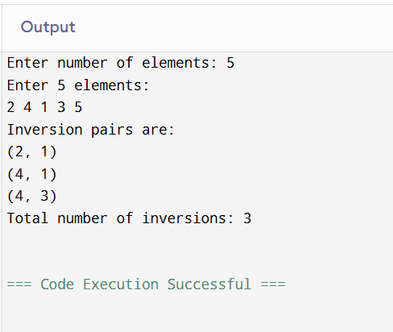

## Question 8:

### Code
```c
#include <stdio.h>

int main() {
    int arr[100], n, i, j, count = 0, unique;

    printf("Enter number of elements: ");
    scanf("%d", &n);

    printf("Enter %d elements:\n", n);
    for (i = 0; i < n; i++) scanf("%d", &arr[i]);

    for (i = 0; i < n; i++) {
        unique = 1;
        for (j = 0; j < i; j++) {
            if (arr[i] == arr[j]) {
                unique = 0;
                break;
            }
        }
        if (unique) count++;
    }

    printf("Total distinct elements = %d\n", count);
    return 0;
}
```

### Output
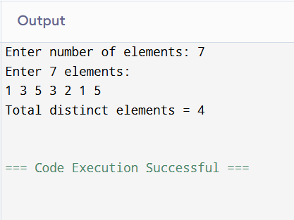


