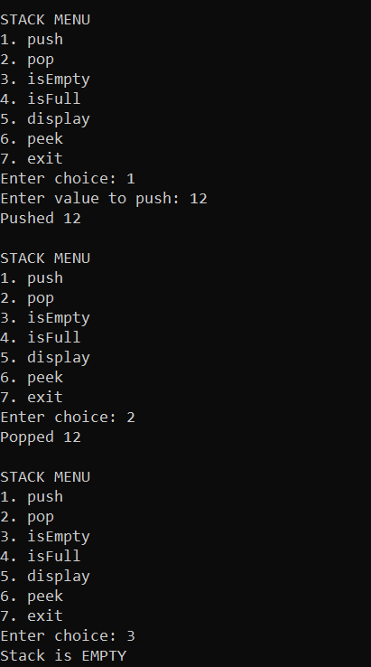
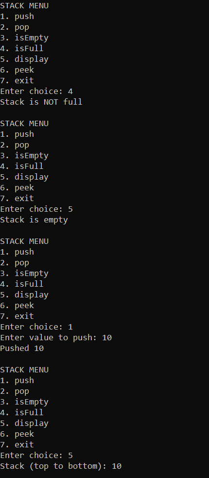
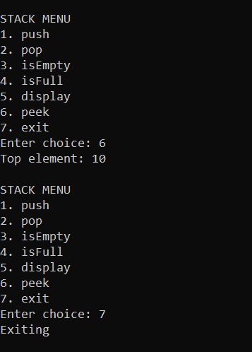
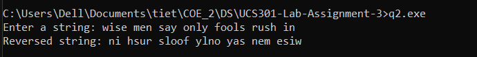
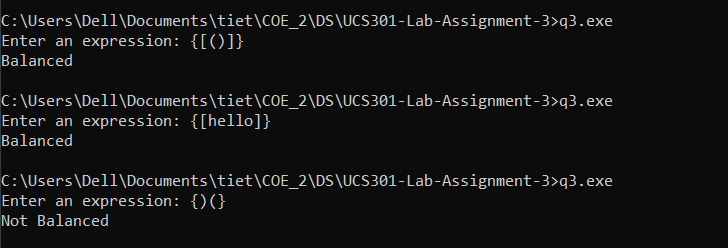
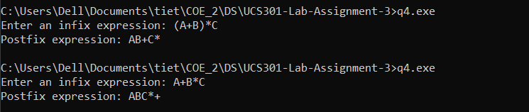

# Lab Assignment 3 : Stack

## Question 1

### Code
```cpp
#include <iostream>
using namespace std;

int main() {
    const int MAX = 100;
    int st[MAX];
    int top = -1;
    int choice, x;

    do {
        cout << "\nSTACK MENU\n";
        cout << "1. push\n2. pop\n3. isEmpty\n4. isFull\n5. display\n6. peek\n7. exit\n";
        cout << "Enter choice: ";
        cin >> choice;

        if (choice == 1) {
            if (top == MAX - 1) cout << "Stack Overflow\n";
            else {
                cout << "Enter value to push: ";
                cin >> x;
                top++;
                st[top] = x;
                cout << "Pushed " << x << "\n";
            }
        } else if (choice == 2) {
            if (top == -1) cout << "Stack Underflow\n";
            else {
                cout << "Popped " << st[top] << "\n";
                top--;
            }
        } else if (choice == 3) {
            if (top == -1) cout << "Stack is EMPTY\n";
            else cout << "Stack is NOT empty\n";
        } else if (choice == 4) {
            if (top == MAX - 1) cout << "Stack is FULL\n";
            else cout << "Stack is NOT full\n";
        } else if (choice == 5) {
            if (top == -1) cout << "Stack is empty\n";
            else {
                cout << "Stack (top to bottom): ";
                for (int i = top; i >= 0; i--) cout << st[i] << " ";
                cout << "\n";
            }
        } else if (choice == 6) {
            if (top == -1) cout << "Stack is empty, no peek\n";
            else cout << "Top element: " << st[top] << "\n";
        } else if (choice == 7) {
            cout << "Exiting\n";
        } else {
            cout << "Invalid choice\n";
        }
    } while (choice != 7);

    return 0;
}
```
### Output





## Question 2

### Code
```cpp
#include <iostream>
#include <string>
using namespace std;

int main() {
    string s;
    cout << "Enter a string: ";
    getline(cin, s); 

    int n = s.length();
    char stack[100]; 
    int top = -1;

    for (int i = 0; i < n; i++) {
        stack[++top] = s[i];
    }

    cout << "Reversed string: ";
    while (top >= 0) {
        cout << stack[top--];
    }
    cout << endl;

    return 0;
}
```
### Output


## Question 3

### Code
```cpp
#include <iostream>
using namespace std;

int main() {
    string expr;
    cout << "Enter an expression: ";
    getline(cin, expr); 

    char stack[100];  
    int top = -1;      

    for (int i = 0; i < expr.length(); i++) {
        char ch = expr[i];

        if (ch == '(' || ch == '{' || ch == '[') {
            top++;
            stack[top] = ch;
        }

        else if (ch == ')' || ch == '}' || ch == ']') {
            if (top == -1) {  
                cout << "Not Balanced\n";
                return 0;     
            }

            char open = stack[top];
            top--;                   

            if (ch == ')' && open != '(') {
                cout << "Not Balanced\n";
                return 0;
            }
            if (ch == '}' && open != '{') {
                cout << "Not Balanced\n";
                return 0;
            }
            if (ch == ']' && open != '[') {
                cout << "Not Balanced\n";
                return 0;
            }
        }
    }

    
    if (top == -1) {
        cout << "Balanced\n";
    } else {
        cout << "Not Balanced\n";
    }

    return 0;
}
```
### Output 


## Question 4

### Code
```cpp
#include <iostream>
#include <string>
using namespace std;

int main() {
    string infix;
    cout << "Enter an infix expression: ";
    getline(cin, infix);

    const int MAX = 1000;
    char stack[MAX];  
    int top = -1;
    string postfix = "";

    for (int i = 0; i < infix.length(); i++) {
        char ch = infix[i];

        if ((ch >= 'a' && ch <= 'z') || 
            (ch >= 'A' && ch <= 'Z') || 
            (ch >= '0' && ch <= '9')) {
            postfix += ch;
        }
       
        else if (ch == '(') {
            stack[++top] = ch;
        }
        
        else if (ch == ')') {
            while (top != -1 && stack[top] != '(') {
                postfix += stack[top--];
            }
            top--; 
        }
        
        else {
            int prec;
            if (ch == '+' || ch == '-') prec = 1;
            else if (ch == '*' || ch == '/') prec = 2;
            else if (ch == '^') prec = 3;
            else prec = 0;

          
            while (top != -1) {
                int topPrec;
                if (stack[top] == '+' || stack[top] == '-') topPrec = 1;
                else if (stack[top] == '*' || stack[top] == '/') topPrec = 2;
                else if (stack[top] == '^') topPrec = 3;
                else topPrec = 0;

                if (topPrec >= prec) {
                    postfix += stack[top--];
                } else {
                    break;
                }
            }
            stack[++top] = ch;
        }
    }

    while (top != -1) {
        postfix += stack[top--];
    }

    cout << "Postfix expression: " << postfix << endl;
    return 0;
}
```

### Output


## Question 5

### Code
```cpp
#include <iostream>
#include <string>
using namespace std;

int main() {
    const int MAX = 1000;
    int st[MAX];     
    int top = -1;

    string exp;
    cout << "Enter a postfix expression (use spaces between numbers/operators): ";
    getline(cin, exp);

    for (int i = 0; i < exp.size(); i++) {
        char ch = exp[i];

        if (ch == ' ') continue;

        if (ch >= '0' && ch <= '9') {
            int num = 0;
            while (i < exp.size() && exp[i] >= '0' && exp[i] <= '9') {
                num = num * 10 + (exp[i] - '0');
                i++;
            }
            i--;
            top++;
            st[top] = num;
        }
        else {
            
            int val2 = st[top]; top--;
            int val1 = st[top]; top--;

            int res = 0;
            if (ch == '+') res = val1 + val2;
            else if (ch == '-') res = val1 - val2;
            else if (ch == '*') res = val1 * val2;
            else if (ch == '/') res = val1 / val2;

            
            top++;
            st[top] = res;
        }
    }

    cout << "Result: " << st[top] << "\n";
    return 0;
}
```
### Output

