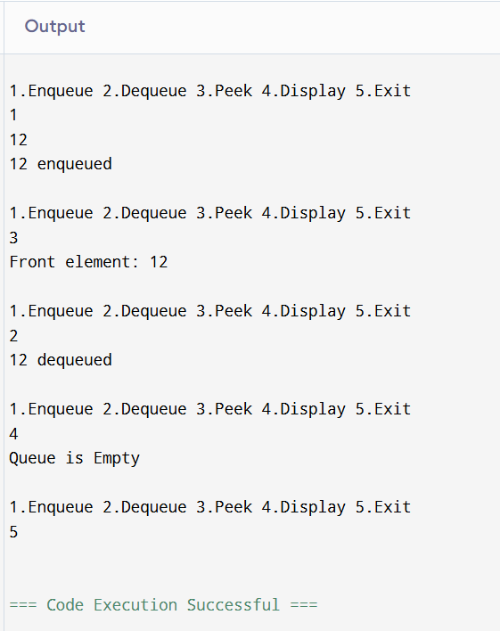
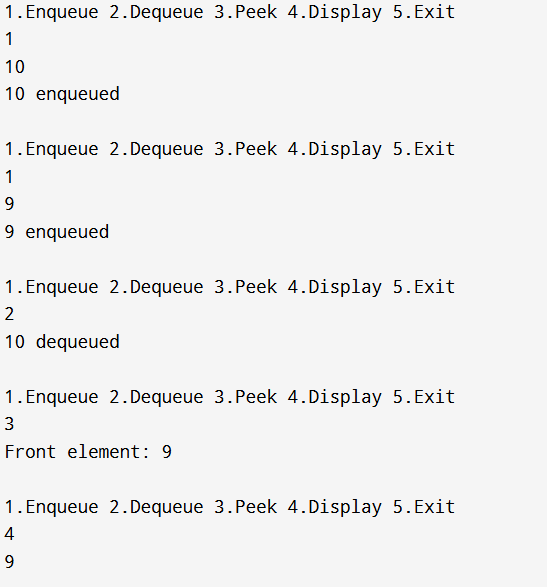
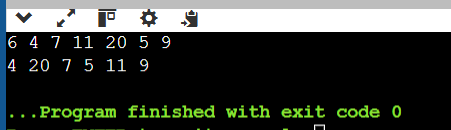
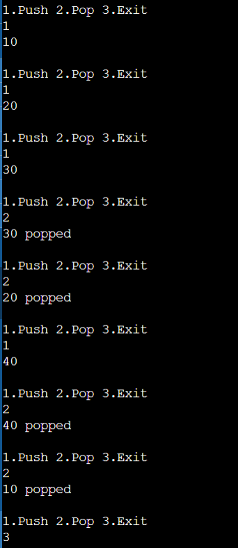
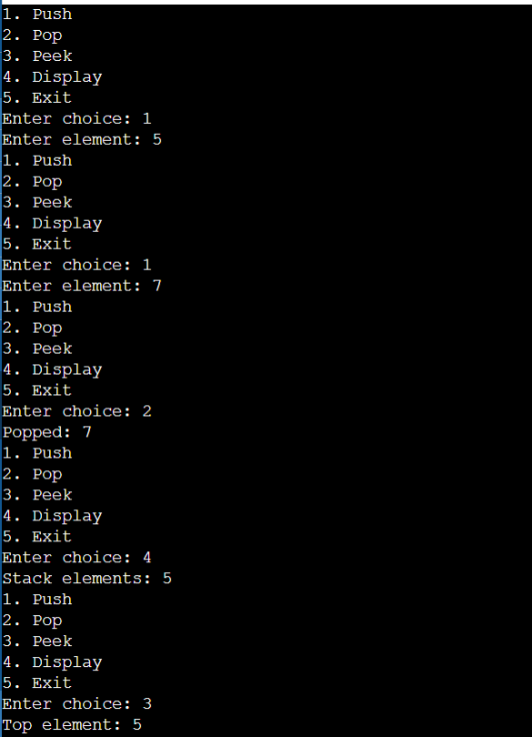

# Data Structures Lab Assignment 4

## Question 1:

### Code
```cpp
#include <iostream>
using namespace std;

#define SIZE 5
int queue[SIZE];
int front = -1, rear = -1;

bool isEmpty() {
    return (front == -1 || front > rear);
}

bool isFull() {
    return (rear == SIZE - 1);
}

void enqueue(int x) {
    if (isFull()) {
        cout << "Queue is Full\n";
    } else {
        if (front == -1) front = 0;
        queue[++rear] = x;
        cout << x << " enqueued\n";
    }
}

void dequeue() {
    if (isEmpty()) {
        cout << "Queue is Empty\n";
    } else {
        cout << queue[front++] << " dequeued\n";
    }
}

void display() {
    if (isEmpty()) {
        cout << "Queue is Empty\n";
    } else {
        for (int i = front; i <= rear; i++) {
            cout << queue[i] << " ";
        }
        cout << "\n";
    }
}

void peek() {
    if (isEmpty()) cout << "Queue is Empty\n";
    else cout << "Front element: " << queue[front] << "\n";
}

int main() {
    int choice, value;
    while (true) {
        cout << "\n1.Enqueue 2.Dequeue 3.Peek 4.Display 5.Exit\n";
        cin >> choice;
        switch (choice) {
            case 1: cin >> value; enqueue(value); break;
            case 2: dequeue(); break;
            case 3: peek(); break;
            case 4: display(); break;
            case 5: return 0;
            default: cout << "Invalid choice\n";
        }
    }
}
```
### Output


## Question 2:

### Code
```cpp
#include <iostream>
using namespace std;

#define SIZE 5
int cqueue[SIZE];
int front = -1, rear = -1;

bool isEmpty() {
    return (front == -1);
}

bool isFull() {
    return ((rear + 1) % SIZE == front);
}

void enqueue(int x) {
    if (isFull()) cout << "Queue is Full\n";
    else {
        if (front == -1) front = 0;
        rear = (rear + 1) % SIZE;
        cqueue[rear] = x;
        cout << x << " enqueued\n";
    }
}

void dequeue() {
    if (isEmpty()) cout << "Queue is Empty\n";
    else {
        cout << cqueue[front] << " dequeued\n";
        if (front == rear) front = rear = -1;
        else front = (front + 1) % SIZE;
    }
}

void display() {
    if (isEmpty()) cout << "Queue is Empty\n";
    else {
        int i = front;
        while (true) {
            cout << cqueue[i] << " ";
            if (i == rear) break;
            i = (i + 1) % SIZE;
        }
        cout << "\n";
    }
}

void peek() {
    if (isEmpty()) cout << "Queue is Empty\n";
    else cout << "Front element: " << cqueue[front] << "\n";
}

int main() {
    int choice, value;
    while (true) {
        cout << "\n1.Enqueue 2.Dequeue 3.Peek 4.Display 5.Exit\n";
        cin >> choice;
        switch (choice) {
            case 1: cin >> value; enqueue(value); break;
            case 2: dequeue(); break;
            case 3: peek(); break;
            case 4: display(); break;
            case 5: return 0;
            default: cout << "Invalid choice\n";
        }
    }
}
```
### Output


## Question 3:

### Code
```cpp
#include <iostream>
using namespace std;

int main() {
    int n;
    cin >> n;
    int arr[n];
    for (int i = 0; i < n; i++) cin >> arr[i];

    int half = n / 2;
    for (int i = 0; i < half; i++) {
        cout << arr[i] << " " << arr[i + half] << " ";
    }
    if (n % 2 != 0) cout << arr[n - 1];
    return 0;
}
```

### Output


## Question 4:

### Code
```cpp
#include <iostream>
#include <string>
using namespace std;

int main() {
    string s;
    cin >> s;

    int freq[256] = {0};  
    string q = "";      

    for (int i = 0; i < s.length(); i++) {
        char ch = s[i];
        freq[ch]++;
        q.push_back(ch); 

        while (!q.empty() && freq[q[0]] > 1) {
            q.erase(0, 1); 
        }

        if (q.empty()) cout << -1 << " ";
        else cout << q[0] << " ";
    }
    return 0;
}
```
### Output


## Question 5a:

### Code
```cpp
#include <iostream>
using namespace std;

#define SIZE 5
int q1[SIZE], q2[SIZE];
int front1 = -1, rear1 = -1, front2 = -1, rear2 = -1;

bool isEmpty(int front, int rear) { return (front == -1 || front > rear); }
bool isFull(int rear) { return (rear == SIZE - 1); }

void enqueue(int q[], int &front, int &rear, int x) {
    if (isFull(rear)) cout << "Queue Full\n";
    else {
        if (front == -1) front = 0;
        q[++rear] = x;
    }
}
int dequeue(int q[], int &front, int &rear) {
    return q[front++];
}

int main() {
    int choice, x;
    while (true) {
        cout << "\n1.Push 2.Pop 3.Exit\n";
        cin >> choice;
        if (choice == 1) {
            cin >> x;
            enqueue(q2, front2, rear2, x);
            while (!isEmpty(front1, rear1)) {
                enqueue(q2, front2, rear2, dequeue(q1, front1, rear1));
            }
            // swap
            int tq[SIZE]; for (int i = 0; i < SIZE; i++) tq[i] = q1[i];
            int tf = front1, tr = rear1;
            for (int i = 0; i < SIZE; i++) q1[i] = q2[i];
            front1 = front2; rear1 = rear2;
            for (int i = 0; i < SIZE; i++) q2[i] = tq[i];
            front2 = tf; rear2 = tr;
        }
        else if (choice == 2) {
            if (isEmpty(front1, rear1)) cout << "Stack Empty\n";
            else cout << dequeue(q1, front1, rear1) << " popped\n";
        }
        else break;
    }
}
```

### Output


## Question 5b:

### Code
```cpp
#include <iostream>
using namespace std;

int main() {
    const int MAX = 100; 
    int q[MAX];           
    int front = 0, rear = -1; 
    int choice, x;

    do {
        cout << "1. Push\n2. Pop\n3. Peek\n4. Display\n5. Exit\n";
        cout << "Enter choice: ";
        cin >> choice;

        if (choice == 1) {  // Push
            cout << "Enter element: ";
            cin >> x;

            if (rear == MAX - 1) {
                cout << "Queue Full\n";
            } else {
                rear++;
                q[rear] = x;

                // Rotate previous elements to maintain stack order
                for (int i = front; i < rear; i++) {
                    int temp = q[front];
                    for (int j = front; j < rear; j++) {
                        q[j] = q[j + 1];
                    }
                    q[rear] = temp;
                }
            }
        }
        else if (choice == 2) {  // Pop
            if (front > rear) {
                cout << "Stack Empty\n";
            } else {
                cout << "Popped: " << q[front] << "\n";
                front++;
            }
        }
        else if (choice == 3) {  // Peek
            if (front > rear) {
                cout << "Stack Empty\n";
            } else {
                cout << "Top element: " << q[front] << "\n";
            }
        }
        else if (choice == 4) {  // Display
            if (front > rear) {
                cout << "Stack Empty\n";
            } else {
                cout << "Stack elements: ";
                for (int i = front; i <= rear; i++) {
                    cout << q[i] << " ";
                }
                cout << "\n";
            }
        }
        else if (choice == 5) {
            cout << "Exiting\n";
        }
        else {
            cout << "Invalid choice!\n";
        }

    } while (choice != 5);

    return 0;
}
```

### Output

